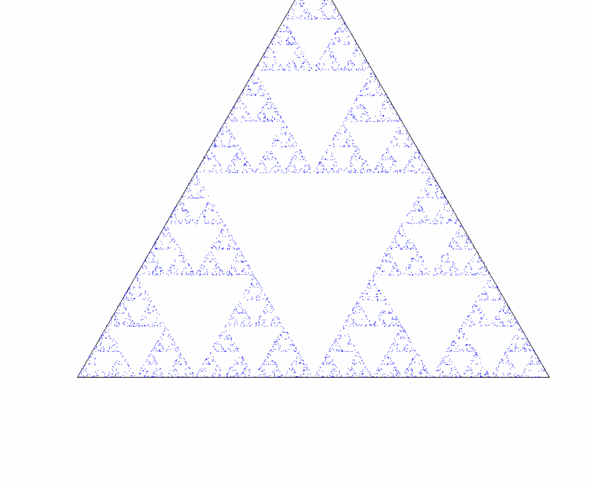

# Chaos Game-Sierpinsky
In mathematics, the term chaos game originally referred to a method of creating a fractal, using a polygon and an initial point selected at random inside it.The fractal is created by iteratively creating a sequence of points, starting with the initial random point, in which each point in the sequence is a given fraction of the distance between the previous point and one of the vertices of the polygon; the vertex is chosen at random in each iteration.

## Sierpinsky Triangle

## Sierpinsky Square

